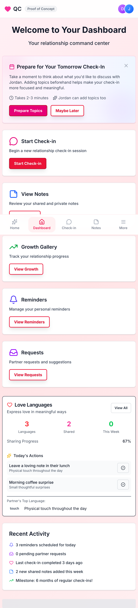
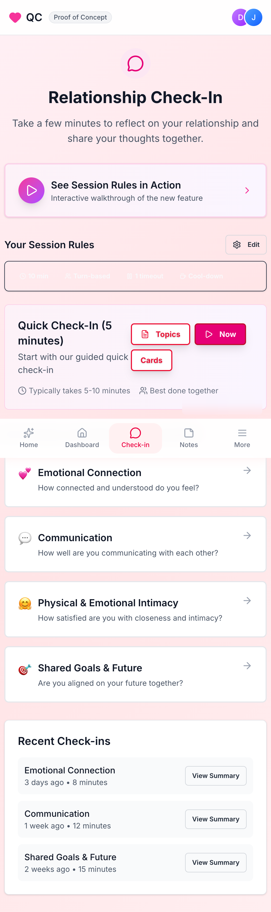
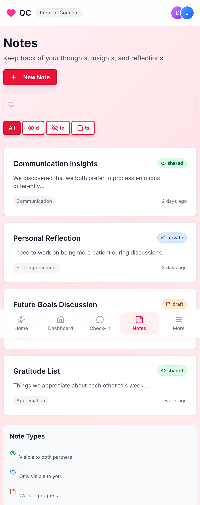
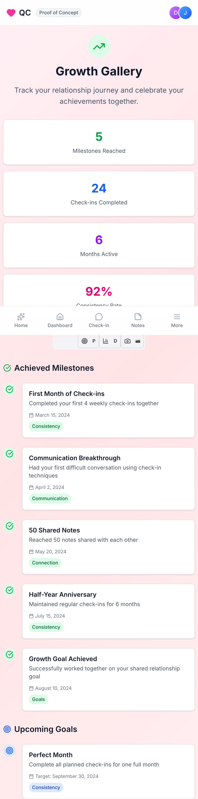
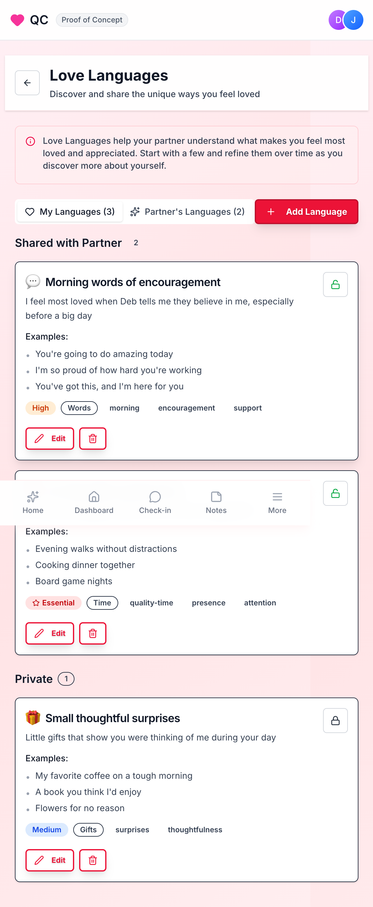
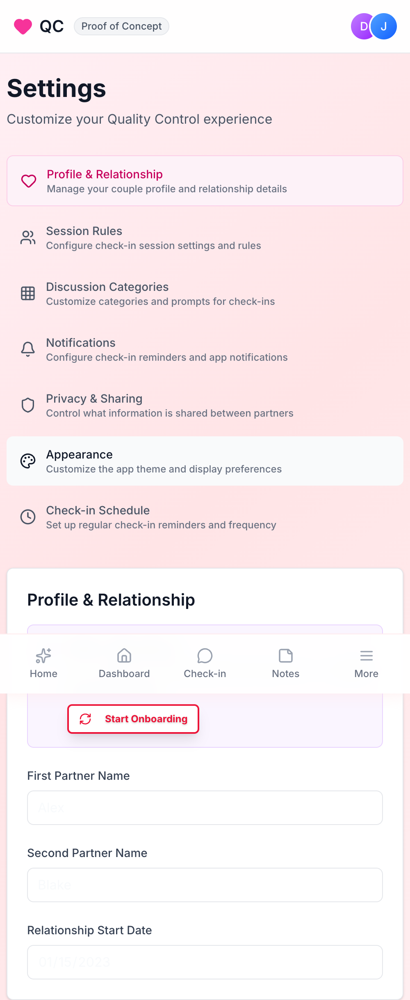
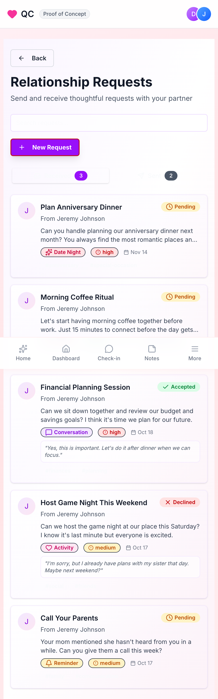
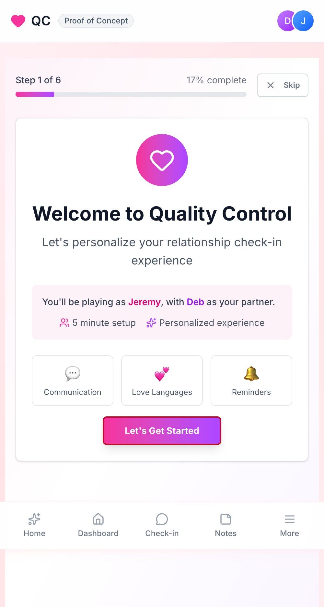

# Quality Control iOS Transformation Plan

**Transforming a Next.js POC into a Production iOS App**

---

## 📋 Table of Contents

1. [Overview](#overview)
2. [Documentation Index](#documentation-index)
3. [Quick Start Guide](#quick-start-guide)
4. [Screenshots](#screenshots)
5. [Timeline Summary](#timeline-summary)
6. [Key Decisions](#key-decisions)
7. [Next Steps](#next-steps)

---

## Overview

This directory contains the complete transformation plan for converting the Quality Control (QC) relationship check-in app from a Next.js proof-of-concept to a production-ready native iOS application.

**Current State:**
- ✅ Working Next.js POC deployed at https://neonwatty.github.io/qc-app/
- ✅ Core features validated with users
- ✅ Mobile-responsive design
- ✅ localStorage-based data persistence

**Target State:**
- 🎯 Native iOS app (Swift/SwiftUI)
- 🎯 CloudKit sync between partners
- 🎯 Push notifications
- 🎯 Home Screen widgets
- 🎯 App Store ready
- 🎯 Premium subscription model

---

## Documentation Index

### Core Planning Documents

| Document | Description | Status |
|----------|-------------|--------|
| **[01-overview.md](./01-overview.md)** | Project overview, goals, and high-level architecture | ✅ Complete |
| **[02-current-state-analysis.md](./02-current-state-analysis.md)** | Comprehensive POC feature inventory and analysis | ✅ Complete |
| **[03-ios-architecture.md](./03-ios-architecture.md)** | Technical architecture, patterns, and code examples | ✅ Complete |
| **[04-data-models.md](./04-data-models.md)** | SwiftData models and persistence strategy | 📝 TBD |
| **[05-feature-roadmap.md](./05-feature-roadmap.md)** | 12-week implementation timeline | ✅ Complete |
| **[06-production-features.md](./06-production-features.md)** | POC → Production feature gaps and enhancements | ✅ Complete |
| **[07-ui-mockups.md](./07-ui-mockups.md)** | iOS design patterns and visual specifications | 📝 TBD |
| **[08-business-model.md](./08-business-model.md)** | Monetization strategy and growth plan | 📝 TBD |

### Supporting Materials

- **`screenshots/`** - POC screenshots in iPhone view (390x844)
  - 01-home-landing.png
  - 02-dashboard.png
  - 03-checkin.png
  - 04-notes.png
  - 05-growth.png
  - 06-love-languages.png
  - 07-settings.png
  - 08-requests.png
  - 09-onboarding.png

---

## Quick Start Guide

### For Product Managers

1. **Start here:** Read [01-overview.md](./01-overview.md) for the big picture
2. **Understand scope:** Review [02-current-state-analysis.md](./02-current-state-analysis.md)
3. **Plan timeline:** Check [05-feature-roadmap.md](./05-feature-roadmap.md)
4. **Identify gaps:** Study [06-production-features.md](./06-production-features.md)

### For iOS Developers

1. **Architecture:** Start with [03-ios-architecture.md](./03-ios-architecture.md)
2. **Data models:** Review SwiftData schemas (document 04)
3. **Weekly tasks:** Reference [05-feature-roadmap.md](./05-feature-roadmap.md)
4. **POC reference:** Explore [02-current-state-analysis.md](./02-current-state-analysis.md)

### For Designers

1. **Current UI:** Browse `screenshots/` directory
2. **Design system:** See [03-ios-architecture.md](./03-ios-architecture.md#design-system)
3. **iOS patterns:** Review document 07 (UI mockups)
4. **Branding:** Maintain POC color scheme and feel

---

## Screenshots

All screenshots captured from the live POC at iPhone 14 Pro dimensions (390x844):

### Dashboard


### Check-in Flow


### Notes System


### Growth Gallery


### Love Languages


### Settings


### Requests Inbox


### Onboarding


---

## Timeline Summary

### 12-Week Plan to MVP

```
Phase 1: Foundation (Weeks 1-2)
├─ Week 1: Project setup, SwiftData models
└─ Week 2: Design system, navigation

Phase 2: Core UI (Weeks 3-4)
├─ Week 3: Dashboard + Check-in (steps 1-3)
└─ Week 4: Check-in (steps 4-6) + Notes

Phase 3: Features Part 1 (Weeks 5-6)
├─ Week 5: Growth Gallery + Reminders
└─ Week 6: Love Languages + Onboarding

Phase 4: Features Part 2 (Weeks 7-8)
├─ Week 7: Requests + Settings (part 1)
└─ Week 8: Settings (part 2) + Polish

Phase 5: Integration (Weeks 9-10)
├─ Week 9: CloudKit sync
└─ Week 10: Push notifications + Widgets

Phase 6: Launch (Weeks 11-12)
├─ Week 11: Testing + Optimization
└─ Week 12: App Store prep + Submission
```

**Target Launch Date:** Week 12
**TestFlight Beta:** Week 11
**First Users:** 50 couples (TestFlight)

---

## Key Decisions

### Technology Choices

| Decision | Choice | Rationale |
|----------|--------|-----------|
| **UI Framework** | SwiftUI 100% | Modern, declarative, future-proof |
| **Persistence** | SwiftData | iOS 17+ native, type-safe, performant |
| **Cloud Sync** | CloudKit | Free, native, privacy-focused |
| **Architecture** | MVVM + Coordinators | Testable, scalable, clear separation |
| **Minimum iOS** | iOS 17.0+ | Access to latest frameworks (SwiftData, Widgets) |
| **Notifications** | UNUserNotificationCenter | Local + remote push support |
| **Analytics** | TelemetryDeck | Privacy-preserving, no tracking |

### Feature Priorities

**Must Have (MVP):**
1. ✅ All POC features (check-ins, notes, growth, etc.)
2. ✅ CloudKit sync for couples
3. ✅ Local notifications
4. ✅ Basic subscription (free + premium)
5. ✅ Onboarding flow

**Should Have (Phase 2):**
1. 📅 Widgets (home screen + lock screen)
2. 📅 Push notifications for partner activity
3. 📅 Photo uploads for memories
4. 📅 Advanced analytics
5. 📅 Shortcuts integration

**Could Have (Phase 3):**
1. 🔮 Apple Watch app
2. 🔮 Live Activities for check-ins
3. 🔮 Voice notes
4. 🔮 AI-powered insights
5. 🔮 Therapist integration

---

## Architectural Highlights

### MVVM Pattern
```swift
View (SwiftUI) ↔ ViewModel (@ObservableObject) ↔ Service → Model (SwiftData)
```

### Data Flow
```
User Action → ViewModel → Service → SwiftData → CloudKit → Partner Device
```

### Offline-First
- All data stored locally in SwiftData
- CloudKit syncs in background
- Offline queue for pending changes
- Conflict resolution on sync

---

## Success Metrics

### Technical
- [ ] <2s cold app launch
- [ ] <100MB app size
- [ ] <0.1% crash rate
- [ ] 60fps animations
- [ ] 80%+ test coverage

### Product
- [ ] 4.5+ App Store rating
- [ ] 1,000 couples in first month
- [ ] <5% weekly churn
- [ ] 30% premium conversion
- [ ] 8+ minute avg session

### Business
- [ ] $50K ARR by Month 6
- [ ] 10,000 MAU by Month 12
- [ ] <$2 CAC (customer acquisition cost)
- [ ] 6+ month payback period

---

## Risk Register

### High Impact Risks

| Risk | Impact | Probability | Mitigation |
|------|--------|-------------|------------|
| SwiftData bugs | High | Medium | Fallback to Core Data |
| CloudKit sync issues | High | Medium | Robust conflict resolution |
| App Store rejection | High | Low | Follow HIG strictly |
| Schedule delay | Medium | High | Cut scope if needed |
| Competition launch | Medium | Medium | Speed to market |

### Risk Response Plans

**If SwiftData is problematic:**
- Switch to Core Data (adds 1 week)
- Proven, stable framework
- More complex but reliable

**If behind schedule:**
- Defer widgets to post-launch
- Simplify check-in flow
- Use more system components
- Extend to Week 14 if critical

**If App Store rejection:**
- 24-hour turnaround on fixes
- Common issues: privacy, data collection
- Have legal docs ready
- Developer Relations escalation

---

## Next Steps

### Immediate Actions (This Week)

1. **Review all planning documents**
   - Gather stakeholder feedback
   - Identify gaps or concerns
   - Approve overall direction

2. **Team assembly**
   - Hire iOS developer (if needed)
   - Engage UI/UX designer
   - Identify QA resources

3. **Infrastructure setup**
   - Apple Developer account ($99/year)
   - CloudKit container provisioning
   - GitHub repository setup
   - CI/CD pipeline (GitHub Actions)

4. **Kickoff preparation**
   - Set up project management tool (Linear, Jira)
   - Create first sprint backlog
   - Schedule weekly standups
   - Establish communication channels

### Week 1 Deliverables

- [ ] Xcode project created
- [ ] SwiftData models defined
- [ ] Demo data generation
- [ ] Navigation structure
- [ ] First commit to Git

---

## Questions & Feedback

### Open Questions

1. **Target devices:** iPhone only, or include iPad in MVP?
   - *Recommendation:* iPhone only for MVP, iPad in Phase 2

2. **Localization:** English only, or multi-language from start?
   - *Recommendation:* English only, i18n-ready architecture

3. **Backend:** CloudKit sufficient, or custom backend needed?
   - *Recommendation:* CloudKit for MVP, evaluate at 10K users

4. **Premium pricing:** $4.99 or $6.99/month for individual tier?
   - *Recommendation:* $4.99 with annual discount

5. **TestFlight beta:** How many users? Invite criteria?
   - *Recommendation:* 50 couples, existing POC users first

### Feedback Process

- **Document updates:** Submit PRs to this repo
- **Weekly reviews:** Every Friday at 2pm
- **Decisions:** Tracked in ADR format (document 09)
- **Change requests:** Use GitHub issues

---

## Resources

### Apple Documentation
- [SwiftUI](https://developer.apple.com/xcode/swiftui/)
- [SwiftData](https://developer.apple.com/xcode/swiftdata/)
- [CloudKit](https://developer.apple.com/icloud/cloudkit/)
- [Human Interface Guidelines](https://developer.apple.com/design/human-interface-guidelines/)
- [App Store Review Guidelines](https://developer.apple.com/app-store/review/guidelines/)

### Tools
- Xcode 15+
- Instruments (performance profiling)
- TestFlight (beta distribution)
- App Store Connect

### Community
- [Swift Forums](https://forums.swift.org/)
- [Apple Developer Forums](https://developer.apple.com/forums/)
- [r/iOSProgramming](https://www.reddit.com/r/iOSProgramming/)

---

## Contact

**Project Owner:** [Your Name]
**Email:** your.email@example.com
**Repository:** github.com/yourcompany/qc-ios

---

## Change Log

| Version | Date | Changes | Author |
|---------|------|---------|--------|
| 1.0 | 2025-10-15 | Initial transformation plan | Claude Code |
| | | - Created 6 core planning documents | |
| | | - Captured 9 POC screenshots | |
| | | - Defined 12-week roadmap | |

---

## License

**Note:** This is a planning document for internal use. All QC app intellectual property remains with the project owner.

---

**Last Updated:** 2025-10-15
**Status:** Draft - Awaiting Approval
**Next Review:** Week 6 Checkpoint (Mid-Project)

---

*This transformation plan is a living document. Updates should be committed to version control with clear change descriptions.*
